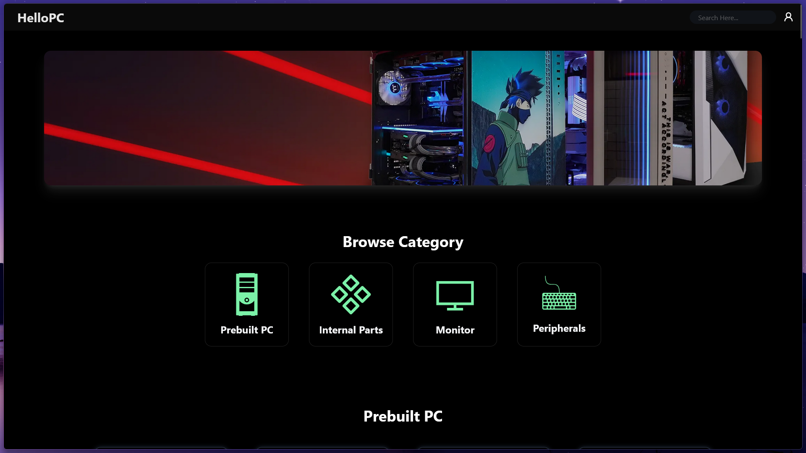
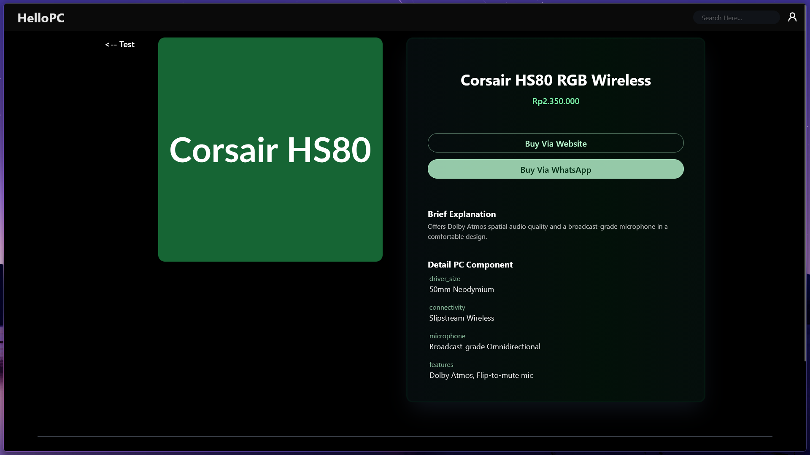
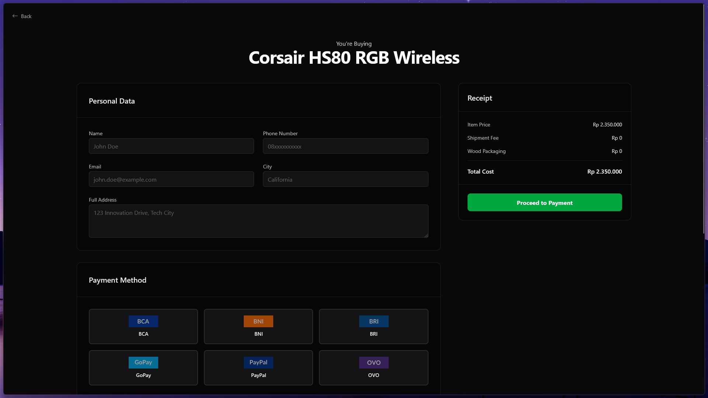

# HelloPC 🖥 Catalogue Web Application

 Selamat datang di repository HelloPC! Ini adalah proyek aplikasi web front-end yang berfungsi sebagai katalog online interaktif untuk berbagai produk perangkat keras komputer, termasuk PC Rakitan (Prebuilt), Komponen Internal, Monitor, dan Periferal.

## 📝 Deskripsi Proyek

HelloPC dirancang untuk menyajikan informasi produk perangkat keras komputer secara dinamis dan menarik. Aplikasi ini memungkinkan pengguna untuk menjelajahi berbagai kategori produk, melihat detail spesifikasi, gambar, dan harga, serta mensimulasikan langkah awal menuju transaksi. Data produk dikelola dalam file JSON terpisah, membuat penambahan atau pembaruan produk menjadi lebih mudah.

## ✨ Fitur Utama

* **Katalog Produk Dinamis:** Menampilkan daftar produk yang diambil secara real-time dari file data JSON.
* **Filter Kategori:** Pengguna dapat dengan mudah beralih antar kategori produk utama:
    * Prebuilt PC
    * Komponen Internal (CPU, GPU, Motherboard, RAM, SSD, PSU, Cooler, Case)
    * Monitor
    * Periferal (Keyboard, Mouse, Headset, Mousepad, Microphone, Webcam, Speaker, Gamepad)
* **Halaman Detail Produk:** Setiap produk memiliki halaman detail (`detail.html`) yang menampilkan:
    * Gambar produk yang lebih besar.
    * Judul dan Harga.
    * Deskripsi singkat (Brief Explanation).
    * Daftar spesifikasi lengkap yang relevan dengan jenis produk.
    * Tombol simulasi pembelian (Via Website & WhatsApp).
* **Halaman Transaksi Sederhana:** Halaman `transaction.html` sebagai placeholder untuk proses checkout, menampilkan item yang dipilih.
* **Komponen UI Reusable:** Header dan Footer dimuat secara dinamis menggunakan JavaScript untuk konsistensi di semua halaman.
* **Desain Responsif:** Dibangun menggunakan Tailwind CSS V4 untuk memastikan tampilan yang baik di berbagai ukuran layar.
* **Loading Indicator:** Menyertakan (meskipun mungkin perlu diaktifkan) layar pemuatan sederhana.

## 🖼 Tampilan (Contoh Placeholder)

*(Sangat disarankan untuk menambahkan screenshot aplikasi Anda di sini!)*

*Tampilan Halaman Utama*


*Tampilan Halaman Detail*


*Tampilan Halaman Detail*


## 🏢Penjelasan Video

Tonton Video Berikut!!
<iframe width="560" height="315" src="https://www.youtube.com/embed/_Z0tn8U9lnU?si=aN8A2WhLHwhu5et_" title="YouTube video player" frameborder="0" allow="accelerometer; autoplay; clipboard-write; encrypted-media; gyroscope; picture-in-picture; web-share" referrerpolicy="strict-origin-when-cross-origin" allowfullscreen></iframe>

## 🛠 Teknologi yang Digunakan

* **HTML5:** Struktur dasar halaman web.
* **CSS3:** Styling visual.
    * **Tailwind CSS v4.1.14:** Framework CSS utility-first untuk desain cepat dan responsif.
* **JavaScript (ES6+):**
    * Manipulasi DOM (Document Object Model).
    * Fetching data dari file JSON (`fetch` API, `async/await`).
    * Routing sederhana berbasis parameter URL (`URLSearchParams`).
    * Pemuatan konten dinamis dan template HTML (`<template>`).
* **JSON:** Format penyimpanan data produk yang terstruktur.

## 🚀 Memulai (Getting Started)

Untuk menjalankan proyek ini di mesin lokal Anda:

1.  **Clone Repository:**
    bash
    git clone [https://github.com/maling1326/HelloPC.git](https://github.com/maling1326/HelloPC.git)
    

2.  **Navigasi ke Direktori Proyek:**
    bash
    cd HelloPC
    

3.  **Buka File `index.html`:**
    * Cara termudah adalah dengan membuka file `index.html` langsung di browser web pilihan Anda.
    * **Penting:** Karena aplikasi ini menggunakan `fetch` untuk memuat file JSON lokal, beberapa browser mungkin memblokir permintaan ini karena kebijakan keamanan (CORS) saat membuka file HTML secara langsung (`file:///...`).
    * **Solusi:** Untuk memastikan semua fitur berjalan lancar, jalankan proyek melalui server web lokal. Beberapa cara mudah:
        * **Menggunakan Ekstensi Live Server (VS Code):** Jika Anda menggunakan Visual Studio Code, instal ekstensi "Live Server" dan klik "Go Live".
        * **Menggunakan Python:** Jika Python terinstal, jalankan perintah `python -m http.server` (Python 3) atau `python -m SimpleHTTPServer` (Python 2) di terminal dari direktori proyek, lalu buka `http://localhost:8000` (atau port yang ditampilkan) di browser.
        * **Menggunakan Node.js:** Instal `http-server` (`npm install -g http-server`), lalu jalankan `http-server` di terminal dari direktori proyek dan buka alamat yang ditampilkan.

## 📂 Struktur Proyek

```
.
├── index.html                  \# Halaman utama (katalog)
├── detail.html                 \# Halaman detail produk
├── transaction.html            \# Halaman simulasi transaksi
├── js/
│   └── apps.js                 \# Logika JavaScript utama aplikasi
├── assets/
│   ├── data/
│   │   ├── style.css             \# File CSS (output Tailwind)
│   │   ├── internal\_component.json \# Data komponen internal
│   │   ├── monitor.json          \# Data monitor
│   │   ├── peripherals.json      \# Data periferal
│   │   ├── prebuilt\_pc.json      \# Data PC rakitan
│   │   └── 8289995\_25336.jpg     \# Contoh gambar latar
│   └── img/                    \# (Direktori untuk gambar produk - jika ada)
└── README.md                   \# File dokumentasi ini
```

## 🤝 Kontribusi

Kontribusi, isu, dan permintaan fitur sangat diterima! Jangan ragu untuk membuka *issue* atau *pull request*.

## 📄 Lisensi

Proyek ini dilisensikan di bawah Lisensi MIT - lihat file `LICENSE` (jika ada) untuk detailnya.

---

*Readme ini dibuat berdasarkan file yang Anda berikan. Sesuaikan bagian seperti URL repository, screenshot, dan lisensi sesuai kebutuhan Anda.*
